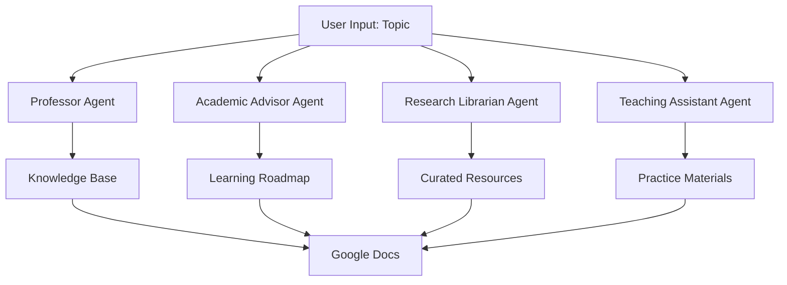

# TeachMate AI 🚀📚  - Your Personal Teaching Assistant

Meet **TeachMate AI**, your ultimate teaching assistant! This smart AI platform combines multiple specialized AI agents to create a comprehensive learning experience. Whether you're a student eager to learn or an educator looking to create course materials, TeachMate AI streamlines the entire learning process by generating structured, easy-to-follow content through Google Docs integration.

## 🤖 AI Teaching Team & Features

Our intelligent teaching team consists of four specialized AI agents, each bringing unique capabilities to your learning journey:

### 1. 👨‍🏫 Professor Agent
- **Role**: Research and Knowledge Specialist
- Creates comprehensive knowledge bases for any topic
- Explains concepts from first principles
- Structures information in an easy-to-understand format
- Generates detailed reports suitable for beginners to experts

### 2. 🎓 Academic Advisor
- **Role**: Learning Path Designer
- Designs structured learning roadmaps
- Maps out logical progression of topics
- Provides estimated time commitments
- Creates personalized learning journeys

### 3. 📚 Research Librarian
- **Role**: Learning Resource Specialist
- Curates high-quality learning resources
- Discovers relevant technical blogs and documentation
- Finds video tutorials and courses
- Evaluates and rates resource quality

### 4. 👩‍🏫 Teaching Assistant
- **Role**: Exercise Creator
- Develops practical exercises and quizzes
- Creates hands-on projects
- Provides detailed solutions and explanations
- Designs real-world application scenarios



## ⚡ Platform Highlights
- **Google Docs Integration**: All content is automatically organized in Google Docs
- **Modern Web Interface**: Clean, user-friendly design built with Streamlit
- **Seamless Collaboration**: All agents work together to create a cohesive learning experience
- **Personalized Learning**: Content tailored to your specific topic and needs

## ✨ Team Members

- **Professor Agent**: Creates comprehensive knowledge bases for any topic
- **Academic Advisor**: Designs structured learning roadmaps
- **Research Librarian**: Curates high-quality learning resources
- **Teaching Assistant**: Develops practice materials and exercises
- **Google Docs Integration**: All content is neatly organized in Google Docs
- **Modern Web Interface**: Built with Streamlit for a clean, user-friendly experience

## 🚀 Getting Started

### Prerequisites

- Python 3.9 or higher
- API keys for:
  - OpenAI
  - Composio
  - SerpAPI

### Installation

1. Clone the repository:
```bash
git clone https://github.com/akhil-bot/TeachMateAI.git
cd TeachMateAI
```

2. Install required packages:
```bash
pip install -r requirements.txt
```

3. Set up your API keys in the application's sidebar:
   - OpenAI API key
   - Composio API key
   - SerpAPI key

## 🎯 Usage

1. Run the application:
```bash
streamlit run main.py
```

2. Open your web browser and navigate to the provided local URL (typically http://localhost:8501)

3. Enter your API keys in the sidebar

4. Input a topic you want to learn about in the main text field

5. Click "Start" to generate comprehensive learning materials

6. Access your personalized learning materials through the provided Google Doc links

## 🏗️ Code Structure

- `main.py`: Core application file containing:
  - Streamlit UI setup
  - AI agent configurations
  - API integrations
  - Response handling logic

### AI Agents

1. **Professor Agent**
   - Role: Research and Knowledge Specialist
   - Creates comprehensive knowledge bases
   - Uses GPT-4 for content generation

2. **Academic Advisor Agent**
   - Role: Learning Path Designer
   - Creates structured learning roadmaps
   - Estimates time commitments

3. **Research Librarian Agent**
   - Role: Learning Resource Specialist
   - Curates learning materials
   - Integrates with SerpAPI for resource discovery

4. **Teaching Assistant Agent**
   - Role: Exercise Creator
   - Develops practice materials
   - Creates hands-on projects

## 🔄 Dependencies

- `streamlit`: Web application framework
- `phi`: AI agent framework
- `openai`: OpenAI API integration
- `composio_phidata`: Composio integration for Google Docs
- Additional tools for web scraping and document processing

## 🚧 Future Improvements

1. **Enhanced Interactivity**
   - Implement progress tracking
   - Include interactive quizzes

2. **Content Improvements**
   - Add support for multimedia content
   - Implement spaced repetition learning
   - Create collaborative learning features

3. **Technical Enhancements**
   - Add caching for faster responses
   - Implement offline mode
   - Add support for more file formats

4. **User Experience**
   - Add user authentication
   - Implement progress saving
   - Create a mobile-friendly interface

## 🤝 Contributing

Contributions are welcome! Please feel free to submit a Pull Request.

## 📝 License

This project is licensed under the Apache License - see the LICENSE file for details.


## 📞 Support

If you encounter any issues or have questions, please open an issue in the GitHub repository.
